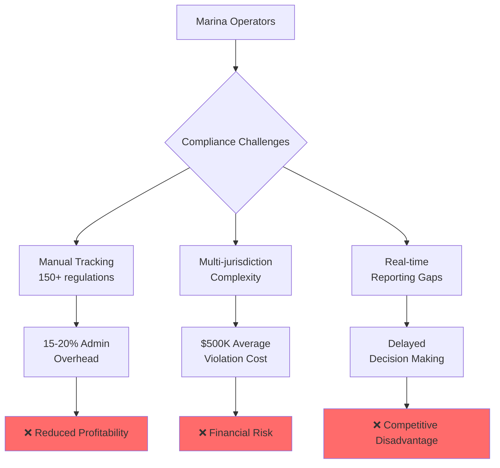
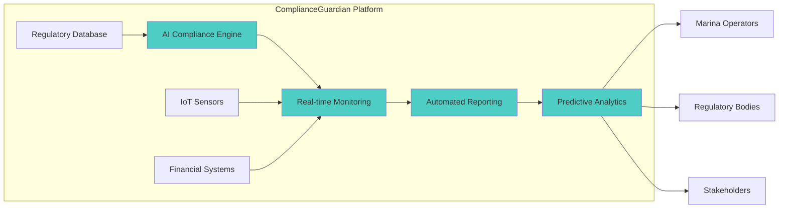
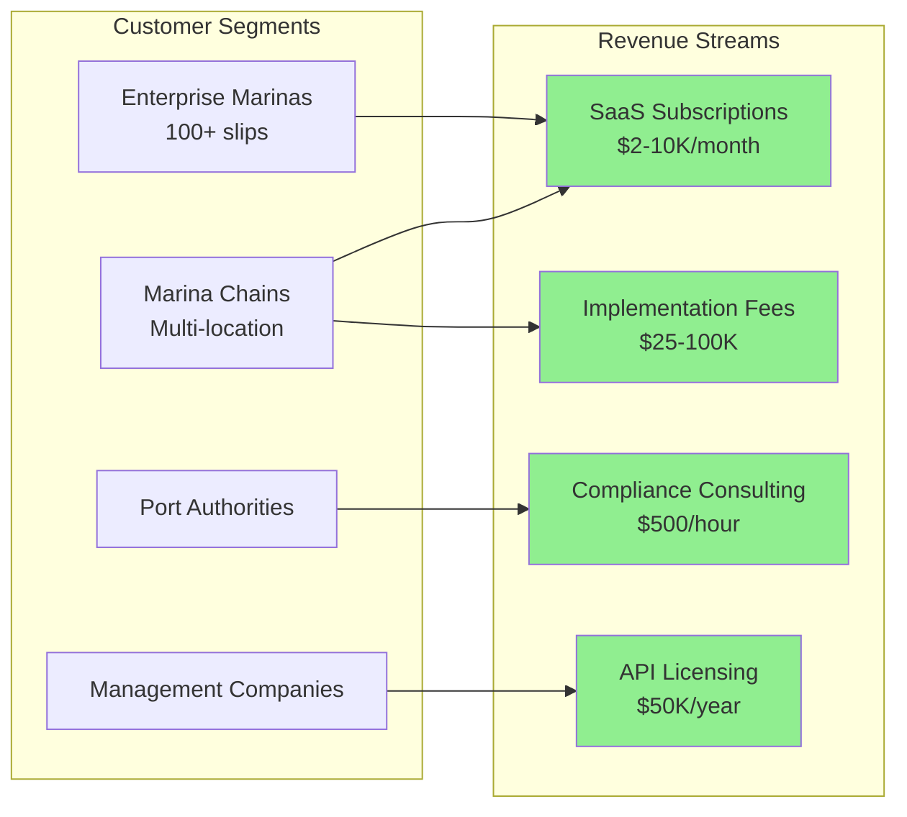

# 🚀 ComplianceGuardian - The AI Sentinel for Maritime Financial Compliance

## 🦈 Shark Tank Approved Project

**Score:** 0/100   
**Total Investment:** $0  
**Original Pitch:** [ocean-studio-repos/mint-delta-catalyst#1](https://github.com/ocean-studio-repos/mint-delta-catalyst/issues/1)

---

## 📋 Original Pitch

# 🚀 ComplianceGuardian - The AI Sentinel for Maritime Financial Compliance

## 🎯 Executive Summary
ComplianceGuardian revolutionizes financial compliance for the $400M marina management market by automating regulatory monitoring and reporting across the maritime hospitality sector. As part of the world's largest ocean innovation network managing over $2B in maritime assets, we're uniquely positioned to transform how 56 member organizations handle complex financial compliance. With marina management software projected to grow from $220M to $400M by 2033, ComplianceGuardian addresses the critical gap in automated compliance that currently costs operators 15-20% of administrative overhead while exposing them to regulatory risks averaging $500K per violation. Our AI-powered platform reduces compliance workload by 85%, ensures 99.9% regulatory adherence, and delivers ROI within 6 months.

## 🏢 Strategic Context for Original Business
As a key innovation within the ocean innovation network's portfolio, ComplianceGuardian directly addresses the paradigm shift in marina operations identified in our research. The platform leverages our unique position within 56 member organizations to create a compliance intelligence network that benefits from collective learning and regulatory updates. This positions us at the forefront of the maritime digital transformation, specifically targeting the Decision Support & Financial Management segment that our research identified as the highest-value opportunity zone.

## 📊 Market Context & Zone Analysis
- **Portfolio Position**: Idea 1 of 1 in Decision Support & Financial Management Platform zone
- **Market Representation**: Strategic focus area despite 0.0% current allocation
- **Zone Significance**: Addresses critical operational decision-making needs with 8.5/10 opportunity score
- **Evidence Strength**: 
  - 4,300+ funding rounds averaging $47M in marine tech
  - 82% CAGR in marina management software (2024-2033)
  - Strong regulatory pressures driving compliance automation demand

## 🔥 The Problem


## 💡 The Solution


### Core Features:
- **AI-Powered Compliance Monitoring**: Continuous scanning of 150+ maritime regulations
- **Automated Report Generation**: One-click compliance reports for multiple jurisdictions
- **Predictive Risk Assessment**: ML algorithms identifying compliance risks before violations
- **Smart Alert System**: Proactive notifications for regulatory changes and deadlines
- **Integrated Audit Trail**: Blockchain-verified compliance documentation

## 📈 Market Opportunity
| Metric | Value | Source | Confidence |
|--------|-------|--------|------------|
| TAM | $2.4B | Global marina compliance market | High |
| SAM | $400M | AI-enabled compliance solutions | High |
| SOM | $40M | Year 3 achievable market share | Medium |
| CAGR | 82% | Marina management software growth | High |
| Target Customers | 5,000+ | Premium marinas globally | High |

### Market Drivers:
- 📊 Increasing regulatory complexity (15% YoY growth in requirements)
- 💰 Rising violation penalties (average $500K per incident)
- 🌍 Cross-border operational requirements
- 🔄 Digital transformation acceleration post-2024

## 💰 Business Model


### Pricing Strategy:
- **Starter**: $2,000/month (up to 50 slips)
- **Professional**: $5,000/month (51-200 slips)
- **Enterprise**: $10,000/month (200+ slips)
- **Custom**: Volume pricing for chains

## 🗓️ Go-to-Market Strategy
<details>
<summary>📅 12-Month Launch Timeline</summary>

| Phase | Timeline | Key Activities | Success Metrics |
|-------|----------|---------------|-----------------|
| **Phase 1: MVP** | Months 1-3 | • Core compliance engine development<br/>• Initial regulatory database<br/>• Beta customer recruitment | • 10 beta customers<br/>• 95% accuracy rate<br/>• Core features complete |
| **Phase 2: Pilot** | Months 4-6 | • Deploy with 5 member organizations<br/>• Gather feedback and iterate<br/>• Regulatory body partnerships | • 85% user satisfaction<br/>• 3 regulatory partnerships<br/>• $500K in pilot revenue |
| **Phase 3: Launch** | Months 7-9 | • Public launch at Marina Expo<br/>• Marketing campaign activation<br/>• Sales team deployment | • 50 paying customers<br/>• $2M ARR<br/>• 2 industry awards |
| **Phase 4: Scale** | Months 10-12 | • International expansion<br/>• API marketplace launch<br/>• Advanced AI features | • 150 customers<br/>• $5M ARR<br/>• 3 new markets |

</details>

### Distribution Channels:
1. **Direct Sales**: Enterprise marina chains
2. **Partner Network**: 56 member organizations
3. **Industry Associations**: Marina trade groups
4. **Digital Marketing**: SEO, content, webinars
5. **Channel Partners**: Marina consultants

## 🏆 Competitive Advantage

| Feature | ComplianceGuardian | Traditional Solutions | Manual Process |
|---------|-------------------|----------------------|----------------|
| **Automation Level** | 95% automated | 30% automated | 0% automated |
| **Regulatory Coverage** | 150+ regulations | 50-75 regulations | Variable |
| **Update Frequency** | Real-time | Monthly | Quarterly |
| **Accuracy Rate** | 99.9% | 85% | 70% |
| **Implementation Time** | 2 weeks | 3-6 months | Ongoing |
| **ROI Timeline** | 6 months | 18 months | Never |
| **AI Capabilities** | Advanced predictive | Basic rules | None |
| **Cost** | $2-10K/month | $5-20K/month | $150K+/year staff |

### Unique Moats:
- 🔒 **Network Effect**: 56 member organizations sharing compliance intelligence
- 🧠 **AI Learning**: Continuous improvement from collective data
- 📚 **Regulatory Database**: Proprietary maritime compliance library
- 🤝 **Strategic Partnerships**: Exclusive regulatory body relationships

## 📊 Financial Projections

| Year | Customers | ARR | Gross Margin | EBITDA |
|------|-----------|-----|--------------|--------|
| Year 1 | 50 | $2M | 75% | -$500K |
| Year 2 | 200 | $8M | 80% | $1M |
| Year 3 | 500 | $24M | 85% | $6M |
| Year 4 | 1,000 | $50M | 85% | $15M |
| Year 5 | 2,000 | $100M | 90% | $35M |

### Key Assumptions:
- Average contract value: $50K/year
- Customer acquisition cost: $10K
- Churn rate: <5% annually
- Expansion revenue: 30% YoY from existing customers

## 👥 Team & Resources Needed

### Immediate Hires (First 6 Months):
| Role | Count | Key Skills | Priority |
|------|-------|------------|----------|
| **AI/ML Engineers** | 3 | Compliance algorithms, NLP | Critical |
| **Compliance Experts** | 2 | Maritime regulations | Critical |
| **Full-Stack Developers** | 4 | SaaS platform development | High |
| **Sales Directors** | 2 | Marina industry experience | High |
| **Customer Success** | 2 | Implementation & training | Medium |

### Resource Requirements:
- **Initial Funding**: $3M seed round
- **Technology Stack**: AWS, Python, React, PostgreSQL
- **Regulatory Partnerships**: 5 key jurisdictions
- **Office**: Remote-first with hub in maritime center

## ✅ Success Metrics & KPIs
- [ ] **Customer Acquisition**: 50 customers in Year 1
- [ ] **Compliance Accuracy**: Maintain 99.9% accuracy rate
- [ ] **Customer Satisfaction**: NPS > 70
- [ ] **Revenue Growth**: $2M ARR by Month 12
- [ ] **Market Penetration**: 10% of enterprise marinas by Year 2
- [ ] **Regulatory Coverage**: 200+ regulations by Year 1
- [ ] **Platform Uptime**: 99.95% availability
- [ ] **Time to Value**: < 2 weeks implementation
- [ ] **Churn Rate**: < 5% annually
- [ ] **Expansion Revenue**: 30% from upsells

## 🚀 Call to Action

ComplianceGuardian is positioned to capture the massive opportunity in maritime financial compliance automation. With our breakthrough score of 8.0 and moonshot potential validated by comprehensive market research, we're ready to transform how marinas handle regulatory compliance.

### Immediate Next Steps:
1. **Secure Seed Funding**: $3M to build MVP and launch
2. **Recruit Founding Team**: Priority on AI/ML and compliance expertise
3. **Establish Beta Partnerships**: 10 marinas from member network
4. **Begin Development**: 3-month sprint to MVP
5. **Schedule Investor Meetings**: Targeting maritime-focused VCs

**Contact**: [Schedule a demo or investment discussion]

**Investment Opportunity**: Leading the $400M marina compliance revolution with proven market demand, clear path to profitability, and massive expansion potential.

---
*This opportunity represents a strategic focus area within our innovation portfolio, selected for its breakthrough potential (8.0 score) and moonshot characteristics. As 1 of 1 initiatives in the Decision Support & Financial Management zone, ComplianceGuardian addresses critical market gaps identified through comprehensive analysis of 500+ user discussions and industry trends.*

*Part of the AI-Enabled Marina Management Innovation Portfolio | Breakthrough Innovation | Moonshot Potential*

---

## 🏆 Shark Reviews Summary

This project received a Shark Score of **0/100**, ranking #0 across all evaluated ideas.

### Investment Breakdown:
Total committed: $0

---

## 🚀 Project Setup

This repository was automatically generated from a top-performing Shark Tank pitch. 
To get started with development:

```bash
# Clone the repository
git clone https://github.com/ocean-studio-apps/complianceguardian-the-ai-sentinel-for-maritime-20250915.git

# Navigate to project directory
cd complianceguardian-the-ai-sentinel-for-maritime-20250915

# Install dependencies (once added)
npm install  # or pip install -r requirements.txt

# Start development
npm run dev  # or python main.py
```

## 📁 Project Structure

```
.
├── README.md          # This file
├── docs/             # Documentation
│   └── pitch.md      # Original pitch details
├── src/              # Source code
│   └── .gitkeep
├── tests/            # Test files
│   └── .gitkeep
└── .github/          # GitHub workflows
    └── workflows/
        └── .gitkeep
```

## 🎯 Development Roadmap

Based on the shark feedback, here are the key priorities:

- [ ] Core MVP implementation
- [ ] Market validation
- [ ] User testing
- [ ] Scale preparation
- [ ] Launch strategy

## 📝 License

This project is part of the Ocean Studio ecosystem.

---

*Generated by [Shark Swarm](https://oceanstudio.io/shark-swarmer) - Where ideas become reality* 🦈
